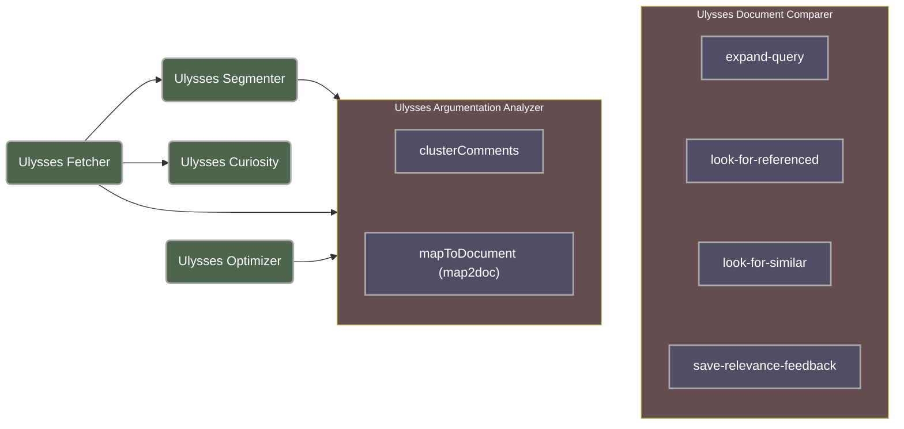

# Ulysses

Ulysses project contains machine learning modules designed to the Brazil's Chamber of Deputies.

---

---

## Available modules
1. Base modules:
    - *Ulysses Fetcher:* fetch pretrained models stored in cloud services;
    - *Ulysses Optimizer:* quantization and optimization methods pretrained model;
    - *Ulysses Segmenter:* semantic segmentation of legal documents into legal items;
    - *Ulysses Curiosity:* probe and validate pretrained models;
2. Integration modules:
    - *Ulysses Argumentation Analyzer:*
        - (microservice) clusterComments;
        - (microservice) mapToDocument.
    - *Ulysses Document Comparer:*
        - (microservice) look-for-similar;
        - (microservice) look-for-referenced;
        - (microservice) expand-query;
        - (microservice) save-relevance-feedback.

## Publication code
Additional research code meant for scientific publication is available at [Ulysses (publicações)](https://github.com/Convenio-Camara-dos-Deputados).
