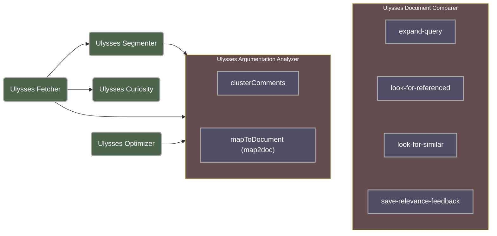

# Ulysses: Enhancing Machine Learning for Brazil's Chamber of Deputies

Ulysses is a comprehensive set of machine learning modules tailored specifically for Brazil's Chamber of Deputies. Our project aims providing tools for data analysis and decision-making processes within the legislative domain of Brazil.

---

## Published works

### 2024

- O. ALBUQUERQUE, Hidelberg et al. UlyssesNERQ: Expanding Queries from Brazilian Portuguese Legislative Documents through Named Entity Recognition. 16th International Conference on Computational Processing of Portuguese (PROPOR 2024). Qualis A4

- PRESSATO, Diany et al. (2024) Natural Language Processing Application in Legislative Activity: a Case Study of Similar Amendments in the Brazilian Senate. 16th International Conference on Computational Processing of Portuguese (PROPOR 2024). Qualis A4

- MAIA, Dyonatan. F.; et al. (2024) Enhancing Stance Detection in Low-Resource Brazilian Portuguese Using Corpus Expansion generated by GPT-3.5. 16th International Conference on Computational Processing of Portuguese (PROPOR 2024). Qualis A4

- GARCIA, Eduardo; et al. (2024) RoBERTaLexPT: A Legal RoBERTa Model pretrained with deduplication for Portuguese. 16th International Conference on Computational Processing of Portuguese (PROPOR 2024). Qualis A4

- Siqueira, Felipe A., Vitório, Douglas, Souza, Ellen, Santos, José A. P., Albuquerque, Hidelberg O., Dias, Márcio S., Silva, Nádia F. F., de Carvalho, André C. P. L. F., Oliveira, Adriano L. I., and Bastos-Filho, Carmelo. 2024. "Ulysses Tesemõ: a new large corpus for Brazilian legal and governmental domain." *Language Resources and Evaluation*. https://doi.org/10.1007/s10579-024-09762-8. Qualis A1

### 2023

- ALBUQUERQUE, Hidelberg et al (2023). Named Entity Recognition: a Survey for the Portuguese Language. Procesamiento del Lenguaje Natural, [S.l.], v. 70, p. 171-185, mar. 2023. ISSN 1989-7553. Disponível em: <http://journal.sepln.org/sepln/ojs/ojs/index.php/pln/article/view/6488>. (Qualis A1) https://doi.org/10.26342/2023-70-14

- JÚNIOR. Flávio Rocha et al. (2023) Avaliação de frameworks para Recuperação de Documentos Legislativos: um Estudo de Caso na Câmara dos Deputados Brasileira. WCGE - XI Workshop de Computação Aplicada em Governo Eletrônico - CSBC 2023. (Qualis B4)
https://doi.org/10.5753/wcge.2023.229925

- O. ALBUQUERQUE, Hidelberg et al. (2023) On the Assessment of Deep Learning Models for Named Entity Recognition of Brazilian Legal Documents. 22nd Conference on Artificial Intelligence - EPIA2023. (Qualis B2)
https://doi.org/10.1007/978-3-031-49011-8_8

### 2022

- ALBUQUERQUE, Hidelberg. O. et al. (2022) UlyssesNER-Br: a Corpus of Brazilian Legislative Documents for Named Entity. In: 15th International Conference on Computational Processing of Portuguese (PROPOR 2022). Lecture Notes in Computer Science, vol 13208. Springer, Cham. https://doi.org/10.1007/978-3-030-98305-5_1. (Qualis A4) 

- COSTA, Rosimeire. P.  et al. (2022) . Expanding UlyssesNER-Br Named Entity Recognition Corpus with Informal User-generated Text. In: European Conference on Artificial Intelligence (EPIA 2022). Proceedings of the EPIA. (Qualis B2)

- MAIA, Dyonatan. F.; et al. (2022). UlyssesSD-Br: Stance Detection in Brazilian Political Polls.  In: European Conference on Artificial Intelligence (EPIA 2022). Proceedings of the EPIA. (Qualis B2)

- VITÓRIO, Douglas et al. (2022) Ulysses-RFSQ: a novel method to improve Legal Information Retrieval based on Relevance Feedback. In: 11th Brazilian Conference on Intelligent Systems (BRACIS 2022). Proceedings of the BRACIS. (Qualis A4)

- COSTA, Marília et. al. No Pattern, No Recognition: a Survey about Reproducibility and Distortion Issues of Text Clustering and Topic Modeling. Preprint. https://www.researchgate.net/publication/362467723_No_Pattern_No_Recognition_a_Survey_about_Reproducibility_and_Distortion_Issues_of_Text_Clustering_and_Topic_Modeling/stats (sem Qualis)

### 2021

- SILVA, Nádia.F.F.. et al. (2021) Evaluating Topic Models in Portuguese Political Comments About Bills from Brazil’s Chamber of Deputies. In: Britto A., Valdivia Delgado K. (eds) Intelligent Systems. BRACIS 2021. Lecture Notes in Computer Science, vol 13074. Springer, Cham. https://doi.org/10.1007/978-3-030-91699-2_8. (Qualis A4)

- SOUZA, Ellen. et al. (2021) Assessing the Impact of Stemming Algorithms Applied to Brazilian Legislative Documents Retrieval. In: XIII Brazilian Symposium in Information and Human Language Technology (STIL 2021). DOI: https://doi.org/10.5753/stil.2021.17802. (Qualis B1)

- SOUZA, Ellen. et al. (2021) An Information Retrieval Pipeline for Legislative Documents from the Brazilian Chamber of Deputies. In: 34th International Conference on Legal Knowledge and Information Systems (JURIX 2021).  https:/DOI:10.3233/FAIA210326. (Qualis B1)

---

## Module overview 

---

## Available modules

1. Base modules:
    - *Ulysses Fetcher:* fetch pretrained models stored in cloud services;
    - *Ulysses Optimizer:* quantization and optimization methods pretrained model;
    - *Ulysses Segmenter:* semantic segmentation of legal documents into legal items;
    - *Ulysses Curiosity:* probe and validate pretrained models;
2. Integration modules:
    - *Ulysses Argumentation Analyzer:*
        - (microservice) clusterComments;
        - (microservice) mapToDocument.
    - *Ulysses Document Comparer:*
        - (microservice) look-for-similar;
        - (microservice) look-for-referenced;
        - (microservice) expand-query;
        - (microservice) save-relevance-feedback.

---

## Publication code
Additional research code meant for scientific publication is available at [Ulysses (publicações)](https://github.com/Convenio-Camara-dos-Deputados).
